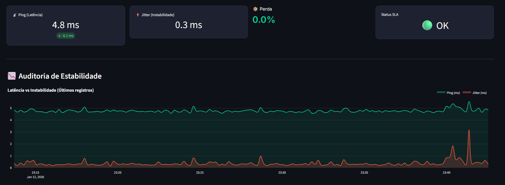

# 🛡️ Network Sentinel Enterprise
### AI-Powered Network Audit & SLA Observability Platform


> **Observabilidade de Rede Real.** Não apenas velocidade, mas Estabilidade, Latência, Jitter e Auditoria Financeira de SLA.

---

## 📖 Sobre o Projeto

O **Network Sentinel** é uma solução completa de monitoramento de rede focada em ambientes corporativos e usuários exigentes. Diferente de *speedtests* comuns que apenas medem a banda máxima, o Sentinel atua como um **Auditor Digital 24/7**.

Ele coleta métricas granulares de estabilidade, utiliza **Inteligência Artificial** para detectar anomalias comportamentais e gera **Dossiês Jurídicos (PDF)** para contestação de faturas e auditoria de SLA (Service Level Agreement) junto às operadoras de internet.

### 🌟 Principais Funcionalidades

* **🕵️ Agente Silencioso:** Coleta dados em background (Ping, Jitter, Packet Loss) sem impactar a performance.
* **🔍 Diagnóstico de Causa Raiz (RCA):** Diferencia automaticamente se a lentidão é na **Rede Interna (Wi-Fi/Switch)** ou na **Operadora (ISP)** comparando latências de Gateway vs. WAN.
* **🧠 IA & Anomalias:** Motor estatístico (Z-Score) que aprende o padrão da sua rede e alerta sobre desvios sutis que ferramentas comuns ignoram.
* **💰 Calculadora Financeira de SLA:** Traduz o tempo de inatividade (downtime) em valores monetários para pedido de reembolso na fatura.
* **📂 Evidência Forense:** Executa `traceroutes` automáticos no momento da falha para provar onde a rota morreu.
* **📊 Dashboard Enterprise:** Painel visual em tempo real (Dark Mode) desenvolvido em Streamlit e Plotly.

---

## 🏗️ Arquitetura do Sistema

O projeto foi desenhado seguindo princípios de microsserviços e desacoplamento:

### 1. The Sentinel Agent (`agent/sentinel.py`)
O "coração" do sistema. Um script Python otimizado para rodar como serviço (Daemon/Task Scheduler).
* **Persistência:** Utiliza SQLite para armazenar milhões de registros de métricas com baixo overhead.
* **Métricas Reais:** Calcula o *Jitter* baseado no desvio padrão de amostras ICMP, não apenas médias simples.
* **Traceroute Trigger:** Só executa diagnósticos pesados (Trace) quando detecta degradação, economizando recursos.

### 2. The AI Core (`core_ai/anomaly.py`)
O "cérebro" estatístico.
* **Algoritmo:** Utiliza análise de *Z-Score* para identificar *outliers*.
* **Aprendizado:** Analisa janelas deslizantes de dados históricos para entender o que é "normal" para a SUA rede naquele horário específico.

### 3. The Visualizer (`dashboard/app.py`)
A interface de comando.
* **Stack:** Construído com Streamlit para renderização rápida e Plotly para gráficos vetoriais interativos (`spline` smoothing).
* **Features:** Injeção de CSS personalizado para visual "Enterprise", modo escuro nativo e atualização assíncrona.

### 4. The Auditor (`dashboard/report_engine.py`)
O motor burocrático.
* **Output:** Gera PDFs formatados com cabeçalhos oficiais, resumo executivo, tabelas de evidência e cálculo de uptime.

---

## 🚀 Como Usar

### Pré-requisitos
* Python 3.9 ou superior instalado.
* Sistema Operacional Windows (recomendado para os comandos de `tracert`/`ipconfig`) ou Linux (com adaptações).

### Instalação

1.  **Clone o repositório:**
    ```bash
    git clone [https://github.com/SEU-USUARIO/network-sentinel.git](https://github.com/SEU-USUARIO/network-sentinel.git)
    cd network-sentinel
    ```

2.  **Instale as dependências:**
    ```bash
    pip install -r agent/requirements.txt
    pip install streamlit plotly pandas fpdf
    ```

3.  **Inicie o Agente (Coletor):**
    Abra um terminal na pasta `agent` e rode:
    ```bash
    python sentinel.py
    ```
    *Dica: Em produção, recomenda-se usar o Agendador de Tarefas do Windows ou criar um executável com PyInstaller.*

4.  **Inicie o Dashboard:**
    Em outro terminal, na pasta `dashboard`, rode:
    ```bash
    python -m streamlit run app.py
    ```

---

## 📸 Screenshots

| Dashboard - Visão Geral | Detecção de Anomalias (IA) |
|:---:|:---:|
|  |  |

---

## 🤖 Built with AI

Este projeto é um exemplo prático da colaboração entre Engenharia de Software humana e Inteligência Artificial Generativa.

* **Concepção & Arquitetura:** Definidas por visão humana focada em dores reais de TI (SLA, Causa Raiz).
* **Codificação & Refinamento:** Acelerada por LLMs (Large Language Models) para estruturação de classes, otimização de queries SQL e design de interface (CSS Injection).

O uso de IA permitiu que funcionalidades complexas (como o motor de anomalias e a geração de PDF) fossem implementadas em tempo recorde, mantendo alta qualidade de código e documentação.

---

## 🤝 Contribua com o Projeto

Este é um projeto **Open Source** e gratuito para uso pessoal ou comercial. O objetivo é empoderar profissionais de TI e pequenas empresas a exigirem a qualidade de internet pela qual pagam.

### Como ajudar?
1.  ⭐ **Dê uma Star** neste repositório! Ajuda muito na visibilidade.
2.  🐛 **Encontrou um bug?** Abra uma Issue.
3.  💡 **Tem uma ideia?** Faça um Fork e mande um Pull Request.

### ☕ Apoie o Desenvolvimento
Se este software ajudou sua empresa a economizar dinheiro com multas de SLA ou otimizou seu tempo de diagnóstico, considere fazer uma doação para manter o desenvolvimento ativo (e o café do desenvolvedor quente! ☕).

* **Solana:** `2FWU8zXggzDS8kVs9LrATEcw7zx6kFZQopZMPVis86Td`
* **Ethereum:** `0xc6f16857D21e54220f5569e0C447699945035E9F`
* **Bitcoin:** `bc1q5v0xycdza652shayr7vlssj563yznz0wyd3eyr`
* **Polygon:** `0xc6f16857D21e54220f5569e0C447699945035E9F`

---

## 📄 Licença

Distribuído sob a licença **MIT**. Veja `LICENSE` para mais informações.

---
Desenvolvido por **Lucas** com auxílio de IA.